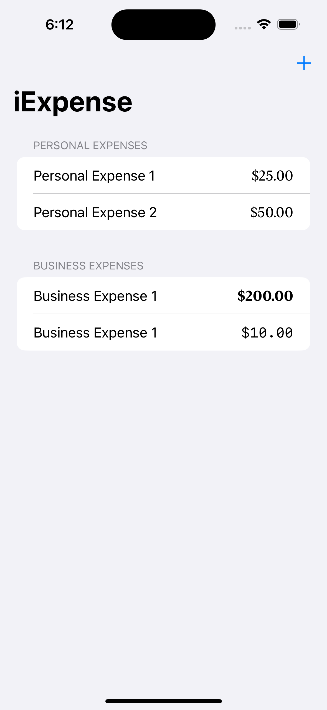
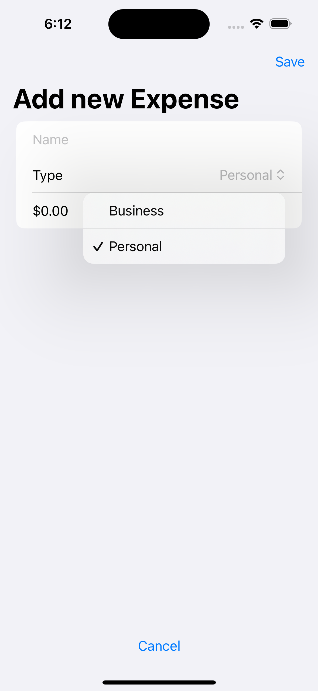
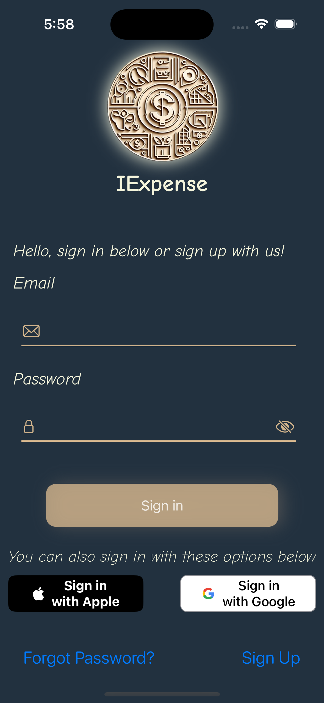
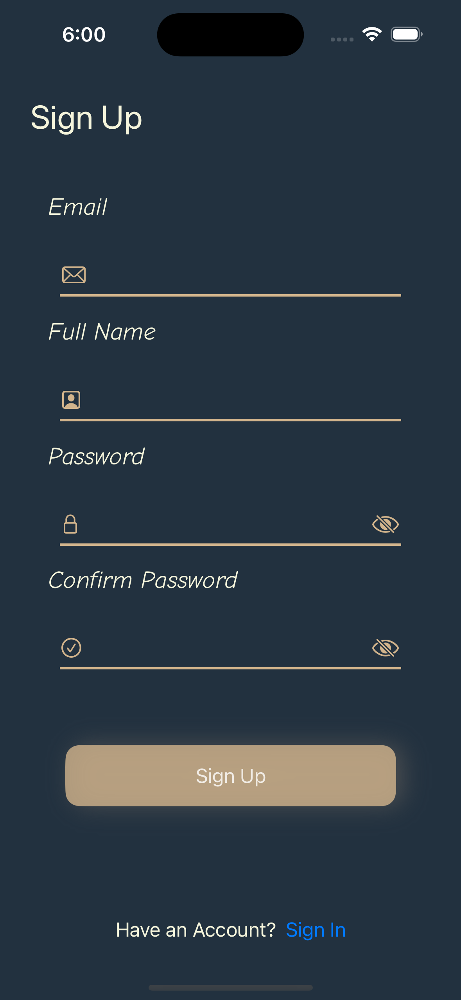
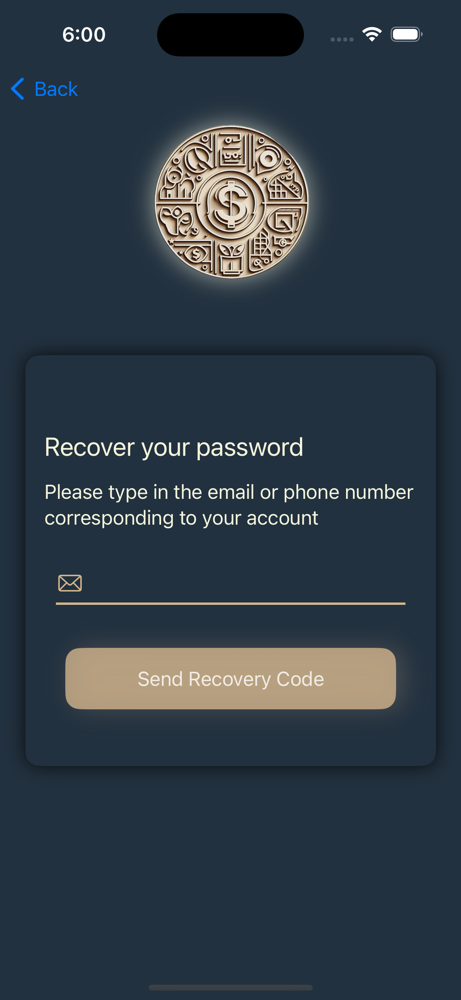

<h1>IExpense</h1>

I knew for some time that I wanted to work on this inital project due to the scale that this app concept could be grown. An expense tracking app isn't revolutionary but was a good opportunity to begin delving into a larger app development while mimicking the mvvm model.

Below is attached the very first iteraion of this project that was meant to be able to store user expenses in two catergories, personal and business.

The inital criteria had no expectations for a large app but rather a few fundamental ideas that swift uses in order to store information across different usages of the app. I began planning the steps of upgrading this app and a few ideas came to mind. Create a user profile for a large app launch, integrate a  modern day bottom bar navigationview, and lastly update the way the information is displayed using core graphs and other tools I haven't had the chance to play with.

<h2>Feature 1: Login View (Incomplete)</h2>

Creating a custom experience for a user with the opportunity of integrating separate login systems was something I wanted to get accustomed to. I created a simple UI with a color scheme that would carry over to the rest of the app starting with this view.

Below is the current iteration of the login page.

To give the app a theme I wanted a logo that would correlate with expenses/money and a color scheme that leaned towards professionalism. Suits came to mind and I was inspired to use a blue color due to it. I followed this blue with a gold tint for text and other elements to match the logo.

This iteration of a login page gives the user options to navigate between creating an account and retrieving a forgotten password. Placing this view in the backburner, a few next steps are to add navigation to the main content view on sign in and to begin merging the UI with firebase as the database.

<h2>Feature 2: Sign Up View (Incomplete)</h2>

A follow up to the login view, this view was very simplistic as the user won't be spending much time here. With the frontend more or less complete, an integration with firebase is something that is in the horizon.

Below is an image of this signup view

Some next steps for this view is to add field authentication logic before the user creates an account such as checking password strength, matching passwords, and email verification.

<h3>Feature 3: Password Retrieval View </h3>

The best of us forget passwords at time so I wanted this app to have a view that could help users retrieve their lost information. Another simple view with not much going on and will likely be seeing changes to the ui.

Next steps for this view include adding an extended view once the user clicks submit in order to display next steps such as writing their verification code depending on the method chosen, phone or email.

There is still a lot of work to complete on this project and will be the main project I put time into for the foreseeable future. I'm excited to see how far this project will go!

Check back for updates as they will be happening often!

